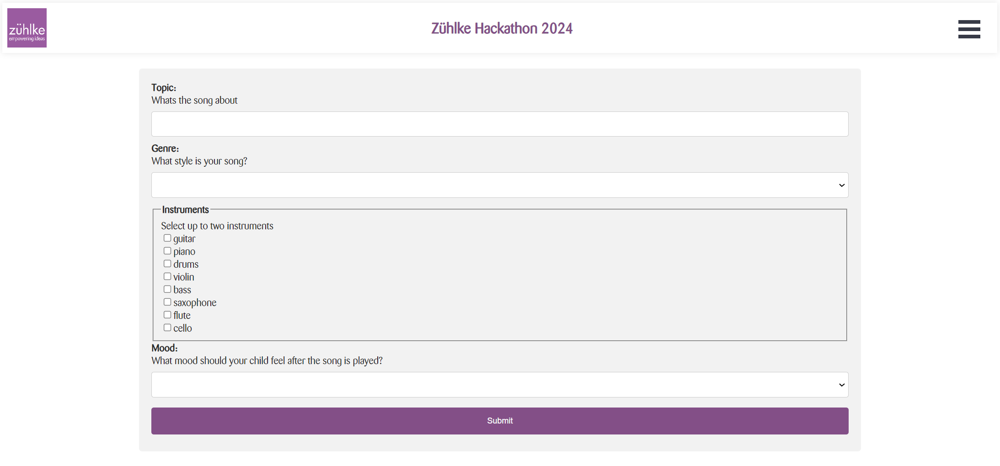
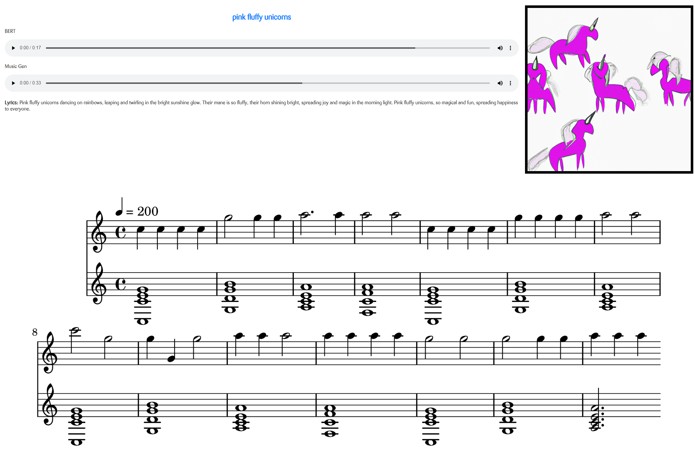

# Java Fullstack Hackathon 2024

---

Would your children like to hear a new toothbrushing song? Do you feel at a loss for ideas? No problem, just have your teeth-brushing song generated!

## Setup

- Spring Backend
- React Frontend
- Using OpenAi + Replicate ([MusicGen](https://replicate.com/meta/musicgen) and [Music-inpainting-bert](https://replicate.com/andreasjansson/music-inpainting-bert))

To run, make sure you have provided Key's for both OpenAi and Replicate.

## Result

### Input

### Output

Music-inpainting-bert:
https://github.com/OliverAmstutz/songWrAIter/assets/25118270/ef74446d-be91-4a73-84ca-6a00bffe5dd6

MusicGen:
https://github.com/OliverAmstutz/songWrAIter/assets/25118270/48500abe-cfa0-48ca-9a8e-a0be7feb0e66

